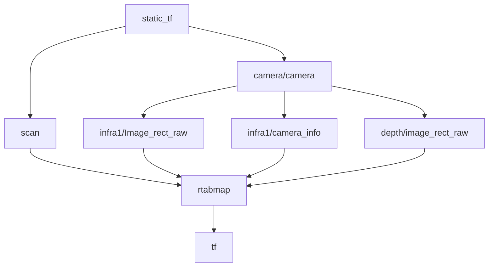

##topic:
###wheel_odom

    frame_id:wheel_odom_link
    child_frame_id:base_link
    nav_msgs/Odometry

###hector_map
    frame_id:hector_map
    child_frame_id:base_footprint
    nav_msgs/Odometry

## rtabmap节点
### realsense_camera:
**topic_name:**
* /camera/depth/image_rect_raw
* /camera/infra1/image_rect_raw
* /camera/infra1/camera_info

